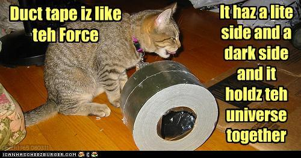

# ducttape: A Crash Course
### [Nathan Schneider](http://nathan.cl)
### 2012-01-03

This is a tutorial for **[ducttape](https://github.com/jhclark/ducttape/)**, a workflow management tool by [Jonathan Clark](http://www.cs.cmu.edu/~jhclark/). Parts are based on his [original tutorial](https://github.com/jhclark/ducttape/blob/master/tutorial/TUTORIAL.md).

Cat pictures are from the Internet.

## Who should use ducttape?

motivation blah blah

## Contents

* _[Installation](https://github.com/jhclark/ducttape/blob/master/README.md#quick-start)_
* [1. Simple Workflows: Tasks and Dependencies](tutorial1.html) [draft]
* [2. HyperWorkflows: Branching and Plans](tutorial2.html) [draft]
* [3. Submitters](tutorial3.html) [TODO. wait until syntax stabilizes?]
* [4. Versioning & Packages](tutorial4.html) [TODO]
* [5. Grab Bag](tutorial5.html) [partial draft]
  - config files
  - directives
  - shorthand variable references
  - ✓ sequence branch points
  - ✓ branch grafting
  - ✓ nested branch points
  - the flat directory structure
  - the attic
* [6. Advanced Example](tutorial6.html) [TODO]
  - a preprocessing pipeline that can be run with different starting/ending points, in a scheduler?
* [7. Reference: Command Line Interface](tutorial7.html) [TODO]
* [8. Reference: Directives](tutorial8.html) [TODO]
* Maybe: a section on modifying workflows after they've been run, including use of `invalidate` and `mark_valid`. What kinds of changes can ducttape cope with? Which changes would screw things up?
  - OK: adding new tasks that are not ancestors of current tasks; adding new branches after existing ones; adding new branch points where the first branch reflects current behavior; adding/modifying/removing plans
  - Bad: renaming a task—it is treated as an entirely new task; removing branch points/branches that have been executed; changing whether an existing task is associated with an existing branch point
  - OK with `invalidate`: change the body of a task; change the inputs, outputs, or parameters of a task
      * if a realization is invalidated, are all realizations that depend on it invalidated as well?
  - ??: changing values for a task variable, with or without a branch point; inserting a task between two existing tasks in the dependency graph
  - modifying a workflow while it is running
* _[Syntax Highlighting Plugins](https://github.com/jhclark/ducttape/blob/master/README.md#emacs-mode)_
* _[Mailing Lists](https://github.com/jhclark/ducttape/blob/master/README.md#updates)_
* _[ducttape Development](https://github.com/jhclark/ducttape/blob/master/HACKING.md)_

Sections [1](tutorial1.html) and [2](tutorial2.html) present the core concepts and features of ducttape. Read these first after installing ducttape on your system. The remaining sections can be consulted independently; they are in no particular order.