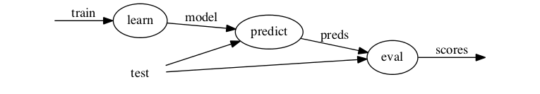

<p style="text-align: center;"><a href="tutorial.md">ducttape: A Crash Course</a>
<a href="tutorial0.md" style="float: left;">&laquo; 0. Installation</a></p>

## 1. Simple Workflows: Tasks and Dependencies

A __workflow__ consists of several related steps, or __tasks__, which are organized in a `.tape` file. This section demonstrates how to create the tasks in a pipeline-structured workflow, indicating inputs and outputs as well as dependencies among tasks in a sequence.

### Starting point

For concreteness, we will have a running example of a simple machine learning workflow with 3 tasks (organized as a pipeline, with each feeding the next):

1. `learn`: train a classifier on some input data, producing a model
2. `predict`: with the learned classifier model, make predictions given some new observations
3. `eval`: measure the predictive power/accuracy of the classifier by comparing the predictions with true (gold) labels

We assume that executables for these three steps are available in the same directory as the `.tape` file; the job of the workflow is to invoke those executables with the correct arguments/resources.

In our example, the classifier will use labeled examples stored in a file called `train` for learning, and examples stored in `test` for evaluation.

The tasks, inputs, and outputs in the workflow can be visualized as follows:

<p style="text-align: center;"></p>

### The first task

To start our workflow, we fire up a text editor and create a file called `classifier.tape` with the following:

```
task learn < in=train > model {
    ../../learner $in > $model
}
```

This defines the `learn` task. Every task consists of a __header__—a line starting with `task`—and a __body__ containing bash commands.

Let us examine the header. It starts with the keyword `task` and the __name__ of the task. Then comes the operator `<`, which introduces __input__ files/directories. Input paths are relative to the directory containing the `.tape` file. This task has one input, the `train` file; this is assigned to the variable `in`, so the body of the task can refer to `$in` rather than the filename directly. One benefit of specifying inputs in the header is that ducttape will automatically ensure they are present before proceeding to the body of the task, and fail with an informative error message if any inputs are missing.

After the inputs are the operator `>` and the __outputs__. This task defines a single output known by the variable `model`. (Because there is no `=` after the variable name, ducttape will use the variable name as the filename as well.) Declaring this output will cause ducttape to verify that it has been created when the task completes. This is especially useful for later tasks in the workflow that expect the model as an input.

The task __body__ is simply a bash command invoking an executable. By default, the body will be run from a sub-sub-directory of the execution directory, so we refer to the executable with the appropriate relative path. (An absolute path would work also.) The argument to the executable is the value of input variable `$in` (which will contain the file path `train`); the executable's output is redirected to the location stored in the output variable `$model`, which in this case will simply be a file called `model`.

### Tasks with dependencies

Now we add two more tasks:

```
task predict < in=test model=$model@learn > preds {
    ../../predictor $model < $in > $preds
}

task eval < gold=test preds=@predict > scores {
    cut -f2 $gold > temp
    paste temp $preds > gold_and_pred
    rm temp
    ../../evaluator gold_and_pred > $scores
}
```

The `predict` task follows the same general pattern as `learn` did. This time there are two inputs, the second of which is the output of `learn`! The expression `model=$model@learn` defines the local (input) variable `model` and assigns to it the value of the `model` variable from the `learn` task. This implicates the entire `learn` task as a dependency of `predict`; ducttape will never start executing `predict` until `learn` has completed successfully.

In general, a task may depend on multiple outputs of multiple other tasks, which would result in a dependency graph more complex than a simple pipeline. The only requirement is that the graph be acyclic.

The final task, `eval`, is defined in a similar manner. It depends on the output of `predict`; the header uses `preds=@predict` as shorthand for `preds=$preds@predict` (because the two variable names are identical). Here we see that the task body may contain arbitrary bash commands, including commands that create and delete temporary files.

_Congratulations—you've completed your first workflow! The result can be seen [here](classifier1-1.tape)._

### Running the workflow

Once the tasks are defined, it's time to debug and execute the workflow. This is done on the command line with the `ducttape` executable. Simply provide the path to your `.tape` file:

```bash
$ ducttape <tape-file>
```

To illustrate some of ducttape's prophylactic capabilities, here is what happens if you give it a [buggy workflow file](classifier1-1buggy.tape):

<div style="white-space: pre-wrap; background-color: #111; color: #eee; padding: 1em; font-family: monaco,consolas,monospace;">
$ ducttape classifier1-1buggy.tape
ducttape 0.2.1
By Jonathan Clark
<span style="color: red;">ERROR: Output modl at source task learn for required by input model at task predict not found. Candidates are: model</span>
<span style="color: blue;">/usr0/nschneid/classifier1-1buggy.tape:5</span>
task predict < in=test model=$modl@learn > preds {
                      ^
<span style="color: blue;">/usr0/nschneid/classifier1-1buggy.tape:1</span>
task learn < in=trainn > model {
^
</div>

We correct the typo `modl` to `model` and repeat, whereupon ducttape finds another bug:

<div style="white-space: pre-wrap; background-color: #111; color: #eee; padding: 1em; font-family: monaco,consolas,monospace;">
<span style="color: red;">ERROR: Output preds at source task learn for required by input preds at task eval not found. Candidates are: model</span>
<span style="color: blue;">/usr0/nschneid/classifier1-1buggy2.tape:9</span>
task eval < gold=test preds=@learn > scores {
                     ^
<span style="color: blue;">/usr0/nschneid/classifier1-1buggy2.tape:1</span>
task learn < in=trainn > model {
^
</div>

Here the bug is that `preds=@learn` should have been `preds=@predict`. If we fix that, it detects one more bug—a mistyped filename:

<div style="white-space: pre-wrap; background-color: #111; color: #eee; padding: 1em; font-family: monaco,consolas,monospace;">
Have 0 previous workflow versions
No plans specified in workflow -- Using default one-off realization plan: Each realization will have no more than 1 non-baseline branch
Checking for completed steps...
Task incomplete learn/Baseline.baseline: No previous output
Task incomplete predict/Baseline.baseline: No previous output
Task incomplete eval/Baseline.baseline: No previous output
Finding packages...
Found 0 packages
Checking for already built packages...
Checking inputs...
<span style="color: red;">ERROR: Input file not found: /usr0/nschneid/trainn required at classifier1-1buggy3.tape:1, defined at classifier1-1buggy3.tape:1</span>
<span style="color: blue;">/usr0/nschneid/classifier1-1buggy3.tape:1</span>
task learn < in=trainn > model {
            ^
<span style="color: blue;">/usr0/nschneid/classifier1-1buggy3.tape:1</span>
task learn < in=trainn > model {
            ^
</div>
All input paths that do not refer to an output of a previous task are checked prior to executing the workflow. Once `trainn` is corrected to `train`, it will be able to find the file.

### Running the workflow, for real

Having worked through the bugs, here's how we execute the [workflow](classifier1-1.tape), assuming that the input files `train` and `test` are present in the current working directory:

<div style="white-space: pre-wrap; background-color: #111; color: #eee; padding: 1em; font-family: monaco,consolas,monospace;">
$ ducttape classifier1-1.tape 
ducttape 0.2.1
By Jonathan Clark
Have 0 previous workflow versions
No plans specified in workflow -- Using default one-off realization plan: Each realization will have no more than 1 non-baseline branch
Checking for completed steps...
Task incomplete learn/Baseline.baseline: No previous output
Task incomplete predict/Baseline.baseline: No previous output
Task incomplete eval/Baseline.baseline: No previous output
Finding packages...
Found 0 packages
Checking for already built packages...
Checking inputs...
Work plan:
<span style="color: #0f0;">RUN:</span> /usr0/nschneid/./<span style="color: cyan;">learn</span>/<span style="color: blue">Baseline.baseline</span>
<span style="color: #0f0;">RUN:</span> /usr0/nschneid/./<span style="color: cyan;">predict</span>/<span style="color: blue">Baseline.baseline</span>
<span style="color: #0f0;">RUN:</span> /usr0/nschneid/./<span style="color: cyan;">eval</span>/<span style="color: blue">Baseline.baseline</span>
Are you sure you want to run these 3 tasks? [y/n]
</div>

Here ducttape indicates which tasks it plans to run. A subdirectory of the current working directory is created for each task, and within each of those is a subdirectory called `Baseline.baseline` from which the task will be run (the reason for this extra subdirectory will become clear in [the next section](tutorial2.md)). Enter `y` at the prompt to continue.

<div style="white-space: pre-wrap; background-color: #111; color: #eee; padding: 1em; font-family: monaco,consolas,monospace;">
Retreiving code and building...
Moving previous partial output to the attic...
Removing broken partial output for learn/Baseline.baseline
Removing broken partial output for predict/Baseline.baseline
Removing broken partial output for eval/Baseline.baseline
Executing tasks...
Acquiring lock for learn/Baseline.baseline
Running learn/Baseline.baseline in /usr0/nschneid/./learn/Baseline.baseline
Using submitter shell
Completed learn/Baseline.baseline
Acquiring lock for predict/Baseline.baseline
Running predict/Baseline.baseline in /usr0/nschneid/./predict/Baseline.baseline
Using submitter shell
Completed predict/Baseline.baseline
Acquiring lock for eval/Baseline.baseline
Running eval/Baseline.baseline in /usr0/nschneid/./eval/Baseline.baseline
Using submitter shell
Completed eval/Baseline.baseline
</div>

The workflow is now complete! Output (along with some task metadata) will be found in the `eval/Baseline.baseline` directory.

### Problems during execution

Here is what would happen if we had included the `learner` executable but forgotten to include the `predictor` executable:

<div style="white-space: pre-wrap; background-color: #111; color: #eee; padding: 1em; font-family: monaco,consolas,monospace;">
Retreiving code and building...
Moving previous partial output to the attic...
Executing tasks...
Acquiring lock for learn/Baseline.baseline
Running learn/Baseline.baseline in /usr0/nschneid/./learn/Baseline.baseline
Using submitter shell
Completed learn/Baseline.baseline
Acquiring lock for predict/Baseline.baseline
Running predict/Baseline.baseline in /usr0/nschneid/./predict/Baseline.baseline
Using submitter shell
predict/Baseline.baseline: bash: line 6: ../../predictor: No such file or directory
Failed predict/Baseline.baseline: Task predict/Baseline.baseline failed
<span style="color: red">ERROR: Task predict/Baseline.baseline failed</span>

EXITING: Cleaning up lock files...
</div>

On the first bash command returning a nonzero exit status, the task fails, and with it any subsequent tasks in the workflow that depend on that task. The next time the workflow is invoked, ducttape recognizes that the `learn` task completed successfully but `predict` failed, and therefore picks up where it left off by restarting the `predict` task:

<div style="white-space: pre-wrap; background-color: #111; color: #eee; padding: 1em; font-family: monaco,consolas,monospace;">
$ ducttape classifier1-1.tape 
ducttape 0.2.1
By Jonathan Clark
Have 5 previous workflow versions
No plans specified in workflow -- Using default one-off realization plan: Each realization will have no more than 1 non-baseline branch
Checking for completed steps...
Task incomplete predict/Baseline.baseline: Non-zero exit code
Finding packages...
Found 0 packages
Checking for already built packages...
Checking inputs...
Work plan:
<span style="color: red">DELETE:</span> /usr0/nschneid/./<span style="color: cyan">predict</span>/<span style="color: blue">Baseline.baseline</span>
<span style="color: #0f0;">RUN:</span> /usr0/nschneid/./<span style="color: cyan">predict</span>/<span style="color: blue">Baseline.baseline</span>
<span style="color: #0f0;">RUN:</span> /usr0/nschneid/./<span style="color: cyan">eval</span>/<span style="color: blue">Baseline.baseline</span>
Are you sure you want to run these 2 tasks? [y/n] y
Retreiving code and building...
Moving previous partial output to the attic...
Removing broken partial output for predict/Baseline.baseline
Executing tasks...
Acquiring lock for predict/Baseline.baseline
Running predict/Baseline.baseline in /usr0/nschneid/./predict/Baseline.baseline
Using submitter shell
Completed predict/Baseline.baseline
Acquiring lock for eval/Baseline.baseline
Running eval/Baseline.baseline in /usr0/nschneid/./eval/Baseline.baseline
Using submitter shell
Completed eval/Baseline.baseline

EXITING: Cleaning up lock files...
</div>

This deletes any partial output from the failed task, reruns it, and then continues onto the `eval` task to complete the workflow.

### Notes about execution

Some important things to keep in mind:

* If the ducttape instance is ended prematurely by `Ctrl-C` or the end of the Unix session, any running tasks will be terminated and marked as unsuccessful. For long-running workflows, the Unix `screen` command can be used to start a session that will persist after the login session ends.
* The __input directory__ for a workflow is the directory containing the `.tape` file. Task input paths are defined relative to this directory.
* The __output directory__ for a workflow can be specified with the `-O` option when invoking ducttape.  It defaults to the current working directory. All workflow information will be maintained under this directory, organized by task.
* Ducttape expects the output directory to have a subdirectory for each task (it will create these if necessary). If multiple workflows are run with the same output directory and share task names in common, ducttape will obliviously use the same task subdirectory for more than one workflow—which may produce unintended consequences.
* Ducttape is capable of running __multiple tasks of a workflow in parallel__ (provided their dependencies have been satisfied). To enable this, specify the maximum number of simultaneous jobs with the `-j` flag: `ducttape <tape-file> -j5` will result in up to 5 tasks running at once.
    - If one of these jobs fails, ducttape will display a failure message but continue running other tasks that do not depend on the failed task. If you want to fix the problem and redo the failed task without interrupting other tasks that are running, you will need to use a new ducttape instance.
* __TODO: anything other crucial notes about the environment?__
* See [3. Submitters](tutorial3.md) for running tasks as jobs in a scheduler.
* See [5. Grab Bag](tutorial5.md) for what to do if you have started running a workflow and need to change it or rerun tasks that completed successfully.

### Global variables

Notice that two tasks—`predict` and `eval`—contain the same hardcoded input file (`test`). This duplication is not ideal; better to use a variable in case the file path needs to be changed. Workflows may define __global variables__ for this purpose: we simply add

```
global {
    evaldata=test
}
```

and change the inputs of `predict` and `eval` to refer to `$evaldata`. The [modified workflow](classifier1-2.tape) can be depicted as follows:

<p style="text-align: center;"></p>

### Task parameters

Often it is desirable to associate metadata other than files and directories with a task. For example, suppose the evaluation step is parameterized by a numeric threshold value that will cause some of the predictions to be ignored. Rather than hard-coding it in the task body, we can set this threshold in the task header with an auxiliary variable called a __parameter__:

```
task eval < gold=$evaldata preds=@predict > scores :: T=0.5 {
    cut -f2 $gold > temp
    paste temp $preds > gold_and_pred
    rm temp
    ../../evaluator $T gold_and_pred > $scores
}
```

The `::` operator after the outputs introduces the parameters. Here we call the threshold `T` and assign it a value of `0.5`. It can be used in the body as a bash variable just like the input and output variables.

_The modified workflow is [here](classifier1-3.tape)._

You may ask: What if I want to try different values of `T`? The answer appears in the [next section](tutorial2.md), which introduces ducttape's killer feature: HyperWorkflows.

### Summary

A ducttape __workflow__ organizes a set of __tasks__, atomic units of execution which may depend on each other, into an acyclic graph. A workflow's tasks are defined in a `.tape` file. The __body__ of a task consists of arbitrary bash commands. The __task header__ declares __variables__ for inputs, outputs, and parameters to be used in the task body. Outputs of a task may be fed into subsequent tasks as inputs.

The command line tool statically checks and then executes a workflow, waiting until a task has completed successfully before starting tasks that depend on it. Failures due to invalid input paths or unsuccessful bash commands are caught early. If the workflow structure and runtime options allow, multiple tasks will be executed in parallel. Output files and metadata such as stdout/stderr logs are placed in a designated directory for each task.

<p style="text-align: right"><a href="tutorial2.md">2. HyperWorkflows: Branching and Plans &raquo;</a>