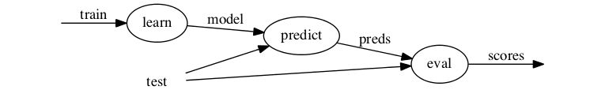
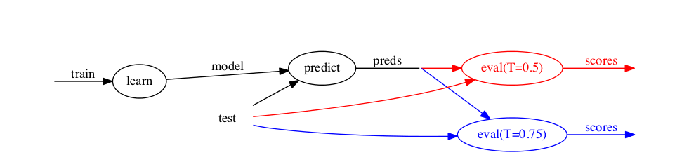
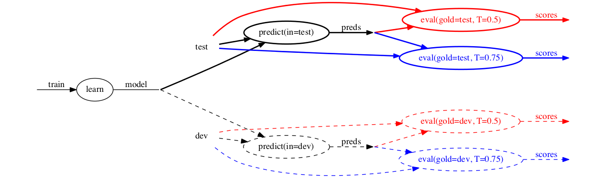
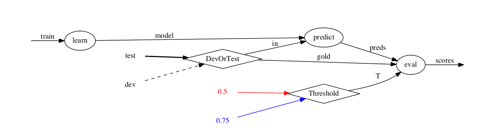

<p style="text-align: center;"><a href="tutorial.html">ducttape: A Crash Course</a>
<a href="tutorial1.html" style="float: left;">&laquo; 1. Simple Workflows: Tasks and Dependencies</a></p>

## 2. HyperWorkflows: Branching and Plans

### Encoding task variants with branches

Recall the pipeline [workflow](classifier1-3.tape) from the previous section:

<p style="text-align: center;"></p>

The final task, `eval`, has a hardcoded threshold parameter `T`. But suppose we want to run the evaluation multiple times with different values for `T`. Duplicating the task to change only the value of `T` is undesirable, especially if many values need to be tested. Including a loop within the body of the task would put the onus on the user to keep track of many different outputs, while hiding the fact that the two variants can be run in parallel.

The best solution is a __HyperWorkflow__, a workflow that specifies dimensions of variation in one or more tasks, implying multiple paths that can be taken to reach the end of the workflow. Each possible decision is called a __branch__. For instance, with `T` allowed to be `0.5` or `0.75` our graph becomes:

<p style="text-align: center;"></p>

Now the `eval` task has two variants, known in ducttape parlance as __realizations__, arrived at via the different branches of `T`. In this case the variants share the same file inputs but produce different outputs.

In the above graph, `learn` and `predict` have only one realization each. But perhaps we want to run the second and third tasks on a development dataset as well as the test set, using the dev set to choose `T` and the test set to gauge final performance. Again, introducing near-copies of the `predict` and `eval` tasks would be cumbersome. Instead we introduce a second __branch point__, or bifurcation in the graph: 

<p style="text-align: center;"></p>

This leaves 1 realization for the `learn` task, 2 for `predict`, and 4 for `eval`. A more compact depiction represents each branch point with a diamond node:

<p style="text-align: center;"></p>

From a branch point graph, the number of realizations of a given task can be calculated by taking the product of the in-degrees of all branch points that are ancestors of that task. (Note that even if `eval` did not depend directly on the `DevOrTest` branch point, it would still depend on it indirectly through the output of `predict`.)

### Defining branch points

The two branch points described above are defined [as follows](classifier2-2.tape):

<!--
```
global {
    # 1st branch point: DevOrTest
    evaldata=(DevOrTest: test dev)
}

task learn < in=train > model {
    ../../learner $in > $model
}

task predict < in=$evaldata model=$model@learn > preds {
    ../../predictor $model < $in > $preds
}

# 2nd branch point: Threshold
task eval < gold=$evaldata preds=@predict > scores :: T=(Threshold: 0.5 0.75) {
    cut -f2 $gold > temp
    paste temp $preds > gold_and_pred
    rm temp
    ../../evaluator $T gold_and_pred > $scores
}

```
-->
<pre><b>global</b> {
    <i># 1st branch point: DevOrTest</i>
    <span style="color: #ff8000;">evaldata</span><span class="o">=(</span><span style="color: #00cc00;"><b>DevOrTest:</b> <span class="nb">test </span>dev</span><span class="o">)</span>
}

<b>task</b> <span style="color: #ff0080;">learn</span> &lt; <span style="color: #ff8000;">in</span>=<span style="color: #9866cc;">train</span> &gt; <span style="color: #ff8000;">model</span> {
    ../../learner <span style="color: #ff8000;">$in</span> &gt; <span style="color: #ff8000;">$model</span>
}

<b>task</b> <span style="color: #ff0080;">predict</span> &lt; <span style="color: #ff8000;">in</span>=<span style="color: #ff8000;">$evaldata</span> <span style="color: #ff8000;">model</span>=<span style="color: #ff8000;">$model</span><span style="color: #ff0080;">@learn</span> &gt; <span style="color: #ff8000;">preds</span> {
    ../../predictor <span style="color: #ff8000;">$model</span> &lt; <span style="color: #ff8000;">$in</span> &gt; <span style="color: #ff8000;">$preds</span>
}

<i># 2nd branch point: Threshold</i>
<b>task</b> <span style="color: #ff0080;">eval</span> &lt; <span style="color: #ff8000;">gold</span>=<span style="color: #ff8000;">$evaldata</span> <span style="color: #ff8000;">preds</span>=<span style="color: #ff0080;">@predict</span> &gt; <span style="color: #ff8000;">scores</span> :: <span style="color: #ff8000;">T</span><span class="o">=(</span><span style="color: #00cc00;"><b>Threshold:</b> 0.5 0.75</span><span class="o">)</span> {
    cut -f2 <span style="color: #ff8000;">$gold</span> &gt; temp
    paste temp <span style="color: #ff8000;">$preds</span> &gt; gold_and_pred
    rm temp
    ../../evaluator <span style="color: #ff8000;">$T</span> gold_and_pred &gt; <span style="color: #ff8000;">$scores</span>
}

</pre>

Each branch point is simply added on the right-hand side of a variable. `T=(Threshold: 0.5 0.75)` indicates that the second branch point, called `Threshold`, determines the value of the `T` parameter. The two branches are called `0.5` and `0.75`, respectively, and assign those values for `T`.[^fn1] 

[^fn1]: The mapping from branch names to values can be specific to the variable being assigned. `T=(Threshold: a=0.5 b=0.75)` would mean the branch called `a` assigns the value `0.5` to `T` in this task, and likewise for branch `b` and value `0.75`. **(TODO: what if two branches have the same value for a variable? does the task get run twice with the same value?)**

A single branch point can be used by multiple tasks/variables of the workflow: `DevOrTest` is shared by `predict` and `eval` via a global variable.[^fn2]

[^fn2]: When a branch point occurs in multiple places, the branch _names_ must be consistent but their _values_ can differ. E.g., a task in the above workflow could specify an additional input `absolute_path=(DevOrTest: test=/path/to/test dev=/path/to/dev)`

### Realization names

When running a realization (task variant), ducttape creates a directory under the task directory. The realization name consists of each branch point (_not_ variable) name coupled with its branch name (_not_ value, if they differ). For example, files for the realization of `eval` in which `T=0.75` and `gold=dev` would go in the directory `eval/DevOrTest.dev+Threshold.0.75`.

The realization consisting of the first branch of every branch point affecting the task is called the Baseline realization. The directory name for this realization is always `Baseline.baseline`. Other realizations are named in terms of their deviation from the baseline. This is to make it easy to add a new branch point—possibly by factoring out part of the task into a new variable!—without invalidating or obscuring the results obtained so far, so long as the existing configuration is maintained in the first branch of the new branch point.

The six realizations in our example would be named as follows:

* `learn` would go in `learn/Baseline.baseline`
* `predict(in=test)` would go in `predict/Baseline.baseline`
* `predict(in=dev)` would go in `predict/DevOrTest.dev`
* `eval(gold=test, T=0.5)` would go in `eval/Baseline.baseline`
* `eval(gold=test, T=0.75)` would go in `eval/Threshold.0.75`
* `eval(gold=dev, T=0.5)` would go in `eval/DevOrTest.dev`
* `eval(gold=dev, T=0.75)` would go in `eval/DevOrTest.dev+Threshold.0.75`

The third, fifth, and sixth of these are known as __one-off__ realizations because they differ from the Baseline in only one way.

If the workflow is executed and new branches are later added to the workflow, it is important not to change the first branch of any branch point, because that is known in existing results only as being part of the Baseline!

### Charting a path through the HyperWorkflow

Executing a HyperWorkflow entails making branching decisions. One option is to execute all possible combinations—the __full cross-product__ of branch points' branches, encompassing all realizations of all tasks—though as the branching complexity of the workflow grows, this quickly becomes intractable. Ducttape therefore allows the workflow designer to specify __plans__ targeting specific execution paths. These can go in the `.tape` file [alongside the workflow itself](classifier2-2.tape). For example:

<!--
```
plan CrossProduct {
    reach eval via (DevOrTest: *) * (Threshold: *)
}

plan Tuning {
    reach eval via (DevOrTest: dev) * (Threshold: *)
}

plan LearnOnly {
    reach learn
}
```
-->
<pre><b>plan</b> <span style="color: #0000ff;">CrossProduct</span> {
    <b>reach</b> <span style="color: #ff0080;">eval</span> <b>via</b> (<span style="color: #00cc00;"><b>DevOrTest:</b></span> *) * (<span style="color: #00cc00;"><b>Threshold:</b></span> *)
}

<b>plan</b> <span style="color: #0000ff;">Tuning</span> {
    <b>reach</b> <span style="color: #ff0080;">eval </span><b>via</b> <span class="o">(</span><span style="color: #00cc00;"><b>DevOrTest:</b> dev</span><span class="o">)</span> * <span class="o">(</span><span style="color: #00cc00;"><b>Threshold:</b></span> *<span class="o">)</span>
}

<b>plan</b> <span style="color: #0000ff;">LearnOnly</span> {
    <b>reach</b> <span style="color: #ff0080;">learn</span>
}
</pre>

Any of these plans can be selected when invoking the ducttape executable with the `-p` flag. The first indicates that all paths leading to the `eval` task should be explored.[^fn3]
The second fixes the dev set as the prediction/evaluation dataset for parameter tuning; a new plan can be added and run later for the test set. The third plan is to run the `learn` task, then stop. (The subsequent steps could be run later.)

[^fn3]: The beginning of a plan expression is a comma-separated list of tasks to be reached. Any dependencies of these tasks are implicit; in this case `eval` is equivalent to `eval, predict, learn`. The wildcard `*` after a branch point name is equivalent to listing all of its branches. A single plan may contain multiple plan expressions, on separate lines.

If no plans are defined for the workflow, ducttape will explore all Baseline and one-off realizations.

If plans _are_ defined, but the `-p` flag is not provided, ducttape will explore the union of all the plans' realizations.

### Example plan execution

Having defined three plans [with our workflow](classifier2-2.tape), in a fresh directory with only the `.tape` file and the required inputs/executables, we first invoke the `LearnOnly` plan:

<div style="white-space: pre-wrap; background-color: #111; color: #eee; padding: 1em; font-family: monaco,consolas,monospace;">
$ ducttape classifier2-2.tape -p LearnOnly
ducttape 0.2.1
By Jonathan Clark
Have 1 previous workflow versions
Finding hyperpaths contained in plan...
Finding vertices for plan: LearnOnly
Have 3 candidate tasks matching plan's realizations: eval learn predict
Found 1 realizations of goal task learn: Baseline.baseline
Found 1 vertices implied by realization plan LearnOnly
Union of all planned vertices has size 1
Planned 1 vertices
Checking for completed steps...
Task incomplete learn/Baseline.baseline: No previous output
Finding packages...
Found 0 packages
Checking for already built packages...
Checking inputs...
Work plan:
<span style="color: #0f0;">RUN:</span> /usr0/nschneid/./<span style="color: cyan">learn</span>/<span style="color: blue">Baseline.baseline</span>
Are you sure you want to run these 1 tasks? [y/n] y
Retreiving code and building...
Moving previous partial output to the attic...
Executing tasks...
Acquiring lock for learn/Baseline.baseline
Running learn/Baseline.baseline in /usr0/nschneid/./learn/Baseline.baseline
Using submitter shell
Completed learn/Baseline.baseline
</div>

Then the `Tuning` plan, which takes advantage of the output from the first:

<div style="white-space: pre-wrap; background-color: #111; color: #eee; padding: 1em; font-family: monaco,consolas,monospace;">
$ ducttape classifier2-2.tape -p Tuning
ducttape 0.2.1
By Jonathan Clark
Have 4 previous workflow versions
Finding hyperpaths contained in plan...
Finding vertices for plan: Tuning
Have 4 candidate tasks matching plan's realizations: eval learn predict
Found 2 realizations of goal task eval: DevOrTest.dev+Threshold.0.75 DevOrTest.dev
Found 4 vertices implied by realization plan Tuning
Union of all planned vertices has size 4
Planned 4 vertices
Checking for completed steps...
Task incomplete predict/DevOrTest.dev: No previous output
Task incomplete eval/DevOrTest.dev: No previous output
Task incomplete eval/DevOrTest.dev+Threshold.0.75: No previous output
Finding packages...
Found 0 packages
Checking for already built packages...
Checking inputs...
Work plan:
<span style="color: #0f0;">RUN</span>: /usr0/nschneid/./<span style="color: cyan">predict</span>/<span style="color: blue">DevOrTest.dev</span>
<span style="color: #0f0;">RUN</span>: /usr0/nschneid/./<span style="color: cyan">eval</span>/<span style="color: blue">DevOrTest.dev</span>
<span style="color: #0f0;">RUN</span>: /usr0/nschneid/./<span style="color: cyan">eval</span>/<span style="color: blue">DevOrTest.dev+Threshold.0.75</span>
Are you sure you want to run these 3 tasks? [y/n] y
Retreiving code and building...
Moving previous partial output to the attic...
Executing tasks...
Acquiring lock for predict/DevOrTest.dev
Running predict/DevOrTest.dev in /usr0/nschneid/./predict/DevOrTest.dev
Using submitter shell
Completed predict/DevOrTest.dev
Acquiring lock for eval/DevOrTest.dev
Running eval/DevOrTest.dev in /usr0/nschneid/./eval/DevOrTest.dev
Using submitter shell
Completed eval/DevOrTest.dev
Acquiring lock for eval/DevOrTest.dev+Threshold.0.75
Running eval/DevOrTest.dev+Threshold.0.75 in /usr0/nschneid/./eval/DevOrTest.dev+Threshold.0.75
Using submitter shell
Completed eval/DevOrTest.dev+Threshold.0.75
EXITING: Cleaning up lock files...
</div>

And finally, `CrossProduct`, which ensures all realizations are covered—3 of which remain:

<div style="white-space: pre-wrap; background-color: #111; color: #eee; padding: 1em; font-family: monaco,consolas,monospace;">
$ ducttape classifier2-2.tape -p CrossProduct
ducttape 0.2.1
By Jonathan Clark
Have 5 previous workflow versions
Finding hyperpaths contained in plan...
Finding vertices for plan: CrossProduct
Have 7 candidate tasks matching plan's realizations: eval learn predict
Found 4 realizations of goal task eval: Baseline.baseline DevOrTest.dev+Threshold.0.75 Threshold.0.75 DevOrTest.dev
Found 7 vertices implied by realization plan CrossProduct
Union of all planned vertices has size 7
Planned 7 vertices
Checking for completed steps...
Task incomplete predict/Baseline.baseline: No previous output
Task incomplete eval/Baseline.baseline: No previous output
Task incomplete eval/Threshold.0.75: No previous output
Finding packages...
Found 0 packages
Checking for already built packages...
Checking inputs...
Work plan:
<span style="color: #0f0;">RUN</span>: /usr0/nschneid/./<span style="color: cyan">predict</span>/<span style="color: blue">Baseline.baseline</span>
<span style="color: #0f0;">RUN</span>: /usr0/nschneid/./<span style="color: cyan">eval</span>/<span style="color: blue">Baseline.baseline</span>
<span style="color: #0f0;">RUN</span>: /usr0/nschneid/./<span style="color: cyan">eval</span>/<span style="color: blue">Threshold.0.75</span>
Are you sure you want to run these 3 tasks? [y/n] y
Retreiving code and building...
Moving previous partial output to the attic...
Executing tasks...
Acquiring lock for predict/Baseline.baseline
Running predict/Baseline.baseline in /usr0/nschneid/./predict/Baseline.baseline
Using submitter shell
Completed predict/Baseline.baseline
Acquiring lock for eval/Baseline.baseline
Running eval/Baseline.baseline in /usr0/nschneid/./eval/Baseline.baseline
Using submitter shell
Completed eval/Baseline.baseline
Acquiring lock for eval/Threshold.0.75
Running eval/Threshold.0.75 in /usr0/nschneid/./eval/Threshold.0.75
Using submitter shell
Completed eval/Threshold.0.75
EXITING: Cleaning up lock files...
</div>

And that's the ballgame!

### Summary

Variables in a task header may be defined with multiple alternative values. This means the task has multiple variants, called __realizations__. There are then multiple ways to execute a workflow, following paths in the realization graph. A path corresponds to a choice of a __branch__ for each __branch point__ associated with one or more tasks on the path. The __Baseline__ realization of each task follows the first branch of every associated branch point. Other realizations are desribed by their deviation from the Baseline, which gives the workflow designer flexibility to add complexity to the workflow after running it.

Executing the full __cross product__ of realizations is often impractical. __Plan__ definitions describe sets of realization paths and can be selected individually for execution with the `-p` flag. If no plans are defined, ducttape defaults to executing all Baselines as well as __one-off__ realizations deviating from the Baseline in only one branch. Once a realization for a task has been executed successfully, it will be considered complete for the current plan as well as any overlapping plan that is run at a later time.

### What's next

This concludes our discussion of the fundamentals of ducttape workflows. The remaining sections contain additional features, examples, and tips. They are intended to be self-contained, so feel free to skip ahead to the sections that are most relevant to you.

<p style="text-align: right"><a href="tutorial3.html">3. Submitters &raquo;</a>