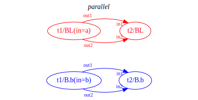
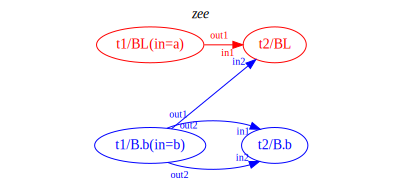
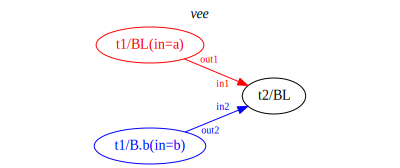
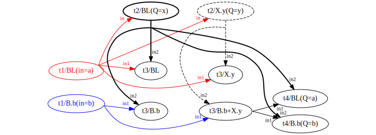

<p style="text-align: center;"><a href="tutorial.html">ducttape: A Crash Course</a>
<a href="tutorial4.html" style="float: left;">&laquo; 4. Versioning &amp; Packages</a></p>

## 5. Grab Bag

This section addresses miscellaneous ducttape features that may prove useful.

### 
    config files
    directives
    shorthand variable references
    the flat directory structure
    the attic

### Sequence branch points

Branches may be expressed as a range of integers using the `..` operator:

```
task run_several_times > x :: trial=(WhichTrial: 1..10) {
  # Use bash's built-in random number generator
  echo $RANDOM > $x
}
```

This creates 10 branches of the `WhichTrial` branch point.

### Nested branch points

Sometimes it is useful to encode hierarchical interactions between multiple branch points. For instance, imagine a cross-validation setup where a prediction step needs to be run for each of 4 folds in development and each of 8 folds at test time. We assume the data for each fold is in a separate file. We wish to encode the prediction mode as `dev` or `test` in a branch point for experimental convenience. This can be expressed succinctly:

```
task predict < in=(DevOrTest: dev=(DevFold: d1 d2 d3 d4)
                             test=(TestFold: t1 t2 t3 t4 t5 t6 t7 t8)) 
             > out { … }
```

Here, a different nested branch point obtains depending on the branch of the outer branch point, `DevOrTest`. We can then define two plans, one targeting the dev set and one targeting the test set, without having to repeat the names of the individual folds.

An alternate strategy would be to use nested sequence branch points:

```
task predict < indir=(DevOrTest: dev=/path/to/dev test=/path/to/test) 
             > out
            :: fold=(DevOrTest: dev=(Fold: 1..4) test=(Fold: 1..8)) { … }
```

In this case the nested branch points have the same name, but different numbers of branches. (In general, they could have different branch names and/or values.) A disadvantage of this approach is that ducttape will check only for the directories containing the input files, not the files themselves: the full filename will have to be assembled in the body of the task by combining `$indir` and `$fold`.

### Branch grafting

As noted in [section 2](tutorial2.html), plans may be used to select execution paths in a HyperWorkflow with many paths, especially if it would be intractable to execute all possible paths. In some cases, however, it is desirable to have a task whose _inputs_ are limited to certain branches.

For example, a machine learning workflow might have a `predict` task that operates separately on dev and test datasets—each with its own branch—and a subsequent `tune` task that uses its output, but only applies to the dev set. We can sketch these two tasks as follows:

```
task predict < in=(DevOrTest: dev=dev.txt test=test.txt) > out { … }

task tune < in=$out@predict[DevOrTest:dev] > out { … }
```

The __branch grafting__ notation `[DevOrTest:dev]` expresses that the input from an upstream task is limited to a particular branch—the `dev` branch of the `DevOrTest` branch point. No realization of the `tune` task will be created for the `test` branch.[^fn1]

[^fn1]: This use case of restricting the paths followed could also be accomplished with a plan, though this is not true of all uses of branch grafting.

#### Advanced branch grafting

The general behavior of branch grafting is difficult to explain, but we will give an informal description and a few examples.

Consider two tasks, _t_ and _t′_, in a dependency relationship established by an input variable _v_ in the header of _t′_. Suppose the upstream task _t_ defines a branch point _B_. There are two scenarios:

  - The input variable _v_ establishes an _unqualified dependency_ between the tasks. Each branch of _B_ can instantiate its own realizations of both _t_ and _t′_. For any given realization, the branch is the same across unqualified or locally defined instances of a branch point.
  - The input variable _v_ establishes a _qualified dependency_ via grafting. A particular branch of _B_ is indicated for that variable. This branch restriction affects _v_ only, and filters the posible realizations of _t′_ insofar as _v_ is constrained to depend on a subset of possible realizations of the upstream taks _t_.

The following workflow is a simple 2-task pipeline with 3 variants of the downstream task:

```
task t1 < in=(B: a b) > out1 out2 { … }

task t2-par < in1=$out1@t1 in2=$out2@t1 { … }

task t2-zee < in1=$out1@t1 in2=$out2@t1[B:b] { … }

task t2-vee < in1=$out1@t1[B:a] in2=$out2@t1[B:b] { … }
```

Both of the inputs in `t2-par` form unqualified dependencies on `t1`. `t2-zee` and `t2-vee` use branch grafting to form qualified dependencies. We depict the three dependency structures as follows:

<div style="text-align: center; min-height: 200px;"><div style="position: relative; display: inline-block; height: 200px; width: 215px;"></div><div style="position: relative; display: inline-block; height: 200px; width: 230px;"></div><div style="position: relative; display: inline-block; height: 200px; width: 240px;"></div></div>

Each realization node is shown with the task name and realization name (_BL_ stands for Baseline.baseline). The diagrams make clear that the grafting in the _zee_ and _vee_ structures does not merely filter the allowed realizations relative to the fully unqualified dependencies (_parallel_): here the grafting actually imposes "cross-branch" or "mixed-branch" dependencies.

#### Another advanced example

The grafting mechanism is powerful enough to allow fairly baroque workflows, such as the following:

```
task t1 < in=(B: a b) > out { … }

task t2 < in=$out@t1[B:a] > out :: Q=(X: x y) { … }

task t3 < in1=$out@t1 in2=$out@t2 > out { … }

task t4 < in1=$out@t3[B:b,X:y] in2=$out@t2[X:x] :: Q=(B: a b) { … }
```

<p style="text-align: center"></p>

TODO: advanced branch grafts example in next section

TODO: interaction b/w grafting and nesting of branch points?

TODO: disjunction of branches?

TODO: is it possible for the `tune` step to access *multiple* outputs of the eval step at once? Kind of like a reduce step?

<p style="text-align: right"><a href="tutorial6.html">6. Advanced Example &raquo;</a>